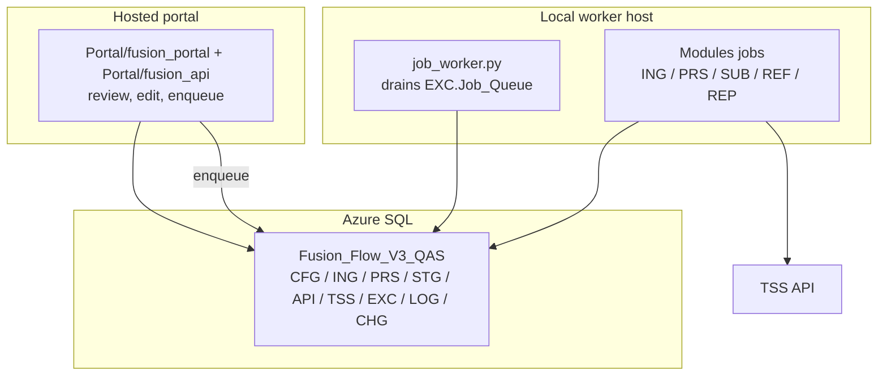

# Fusion Flow V3 Architecture

V3 is a hybrid system.

There is one core database. The portal can be hosted, but the heavy work can
still run locally where the mailbox, file shares and TSS access make sense.

## Simple version

## Why split it like this?

- The portal is for operators: view, edit, approve, trigger.
- The modules are for work: ingest, process, validate, submit, mirror.
- The database is the source of truth.
- TSS calls should run from the allowed environment, not accidentally from any
  machine that can open the UI.

## Main layers

| Layer | Job |
| --- | --- |
| `ING` | Store source evidence exactly as received. |
| `PRS` | Build the clean object we intend to submit. |
| `STG` | Hold the operational submit-ready copy. |
| `API` | Store every request and response. |
| `TSS` | Mirror what TSS says now. |
| `EXC` / `LOG` | Record runs, status, errors and timings. |
| `CHG` | Record deployments and manual changes. |

## Portal vs worker

The current hosted portal lives in `Portal/fusion_portal` with its API in `Portal/fusion_api`. `liveWeb` remains the single-service portal shape for the module-first product. The portal can run a small action directly, but the preferred pattern is:

1. operator clicks an action,
2. portal writes a row to `EXC.Job_Queue`,
3. local worker claims it,
4. local worker runs the same module script,
5. result is written back to the database.

That gives us a hosted UI without moving all execution to the cloud.

## Scheduling

Pick one scheduler. Do not run the same job from two places.

Recommended default:

- local Task Scheduler / SQL Agent runs recurring jobs,
- local `job_worker.py` handles queued portal actions,
- hosted portal only reads, edits and enqueues.

## Safety rules

- Dry-run first for submit/update/cancel.
- Store request/response JSON for TSS calls.
- Use official TSS status for notifications.
- Do not treat local status as final truth.
- Keep secrets in env/ini/secret store, not in git.
- Keep manual edits auditable.

## What this architecture avoids

- One-off scripts with no trace.
- Portal routes doing business logic.
- Reprocessing without knowing the original source.
- Submitting data that already failed local validation.
- Losing the reason why a value was defaulted, changed or blocked.
