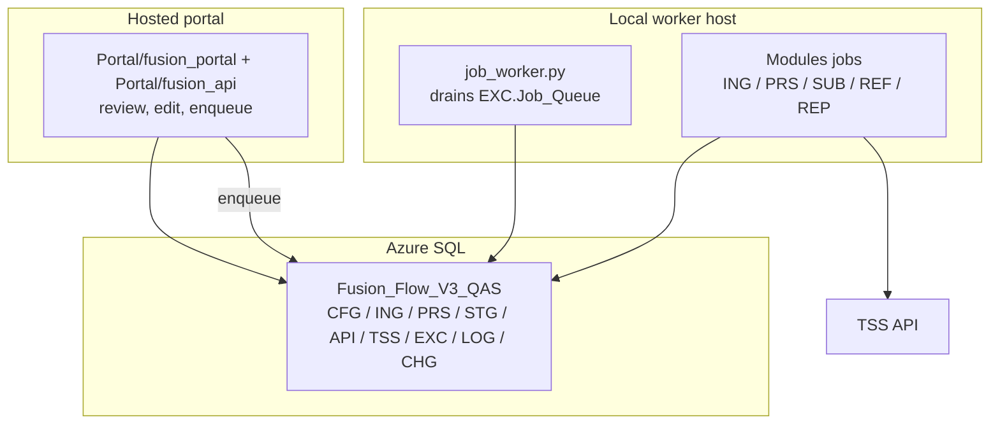

# Fusion Flow V3 Architecture

This is the short version.

Fusion Flow V3 has three moving parts:

1. the portal,
2. the modules,
3. the database.

The portal is for people. The modules do the work. The database remembers everything.

## Simple Picture



## Who Does What?

| Part | Job |
| --- | --- |
| Portal | Show, review, edit and trigger work. |
| Modules | Ingest, process, validate, submit and sync. |
| Database | Store source evidence, clean data, audit and TSS responses. |
| TSS | Official external system. |

## Why Not Put Everything In The Portal?

Because then the portal becomes a big hidden script.

That is hard to test, hard to audit and easy to break. V3 should keep business work in `Modules/`, with the portal acting as the control surface.

## Main Flow

```text
ING: what arrived
CFG: what we trust
PRS: what we plan to send
STG: what is ready to submit
API: what we called
TSS: what TSS returned
```

## Portal And Worker

Preferred pattern:

1. operator clicks an action in the portal,
2. portal writes a job to `EXC.Job_Queue`,
3. local worker claims the job,
4. worker runs the module script,
5. module writes the result back to the DB,
6. portal reads the result.

That gives us a hosted UI without moving every TSS call into the cloud.

## Scheduling

Pick one scheduler. Do not run the same job from two places.

Default direction:

- local Task Scheduler / SQL Agent runs recurring jobs,
- local `job_worker.py` handles queued portal actions,
- hosted portal reads, edits and enqueues.

No new cron/schedule should be added unless it is approved first.

## Safety Rules

- Dry-run first for submit/update/cancel.
- Store request and response JSON for TSS calls.
- Use official TSS status for notifications.
- Keep secrets out of git.
- Keep manual edits auditable.
- Do not create tables just because a script feels easier that way.