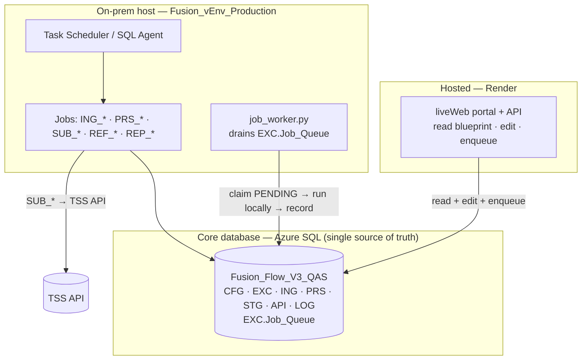

# Fusion Flow V3 QAS — Architecture (Hybrid)

## Principle

**One core database is the single source of truth. Compute is split.**

- **Local jobs** (on-prem) do the heavy, scheduled, network-sensitive work — email
  ingestion, processing, and TSS submission — because they need local file drops, the
  mailbox, and a known/allow-listed outbound IP for the TSS API.
- **The portal** (`liveWeb/`) is the hosted operator UI. It connects to the same core
  database to show live status, edit payloads, and *trigger* jobs.

Both sides talk to the same database; neither owns state on its own machine.

## The core database

- **Azure SQL** — `futureworks-sdi-db.database.windows.net` / `Fusion_Flow_V3_QAS`.
- Holds **all** state: `CFG` (config/control), `EXC` (execution spine **+ `Job_Queue`**),
  `ING` (raw), `PRS` (canonical), `STG` (submission-ready), `API` (per-call log), `LOG`.
- Every component connects with the same `DB_*` credentials — env vars first, else the
  gitignored `Configuration/Fusion_Flow_QAS.ini`. There is no second database and no
  local cache of record.

## Where each piece runs, and why

### Local / on-prem (the production venv host)
Runs on the machine that already hosts `Fusion_vEnv_Production` and runs `deploy.py`
and the D365 sync. Scheduled by **Windows Task Scheduler / SQL Agent**.

| Job | Why it must be local |
| --- | --- |
| `ING_00_run_cycle` (+ `ING_01/02/03`) | reads the mailbox (Graph) and local INBOUND file drops |
| `PRS_01_engine` / `PRS_02_reprocess` | transform + validate (DB-only, kept next to ingestion) |
| `SUB_01…06` (promote/submit/mirror/update/cancel/fetch) | TSS API calls from the **allow-listed on-prem IP** |
| `REF_*` / `REP_*` | reference pulls / Excel exports |
| `job_worker.py` | drains `EXC.Job_Queue` and runs the above **locally** on demand |

### Hosted (Render — the portal)
`liveWeb/` (`synovia-flow-3-live`). Connects to the core DB to:
- serve the portal + `GET /api/blueprint` (live read),
- `POST /api/edit` (write whitelisted STG fields),
- `POST /api/enqueue/<verb>` (request a job — see the bridge below).

## The bridge — `EXC.Job_Queue`

This is what makes the hybrid clean:

1. An operator clicks a button in the hosted portal → `POST /api/enqueue/<verb>` writes a
   `PENDING` row (`verb`, `MovementKey`).
2. The **local** `job_worker.py` polls, claims the row atomically (`READPAST`/`UPDLOCK`),
   and runs the runner **on-prem** with per-run scope.
3. The outcome is written back to `EXC.Job_Queue` and the normal `EXC`/`API.Call` logs.

So the **UI is hosted** but **execution stays local** — TSS calls originate from the
on-prem IP, and no cloud host needs TSS access.

## Two ways the portal can trigger a job

| Mode | Endpoint | Runs where | Use |
| --- | --- | --- | --- |
| **Queued** (recommended for hybrid) | `POST /api/enqueue/<verb>` | the **local** worker | keeps TSS/DB calls on-prem; portal returns immediately (202) |
| In-process | `POST /api/action/<verb>` | wherever the **portal** runs | only if the portal host itself is allowed to reach TSS + the DB |

For the hybrid, prefer **enqueue** so the local worker is the single place jobs execute.

## Scheduling — pick ONE

Run recurring jobs from **either** on-prem Task Scheduler **or** the Render crons in
`render.yaml`, not both (avoid double-runs):

- **Local (recommended here):** Task Scheduler entries for `ING_00_run_cycle`,
  `PRS_01_engine`, `SUB_03_mirror` (status), etc. Comment out the `ff-cron-*` services
  in `render.yaml`.
- **Cloud:** keep the `ff-cron-*` services — but then Render's egress IPs must be
  allow-listed on Azure SQL and TSS.

## Network / firewall checklist

- **Azure SQL firewall:** allow the **on-prem host IP** (local jobs + worker) and, if the
  portal reads the DB from Render, the **Render service egress IPs** (portal reads/edits).
- **TSS API:** allow whichever host makes submission calls (on-prem for the hybrid).
- **Secrets:** `DB_PASSWORD` and TSS credentials live in the local `.ini` /
  `CFG.Credentials` on-prem and as Render secrets for the portal — never committed.

## Recommended default

- **Portal** → Render: read + edit + **enqueue** only.
- **Local host** → the **worker** (always-on) + **Task Scheduler** for the recurring jobs.
- **Render `ff-cron-*` / `ff-worker`** → disabled (local runs them).

This keeps one core DB, a hosted UI everyone can reach, and all real execution on-prem
where the mailbox, files, and allow-listed TSS/DB access live.
