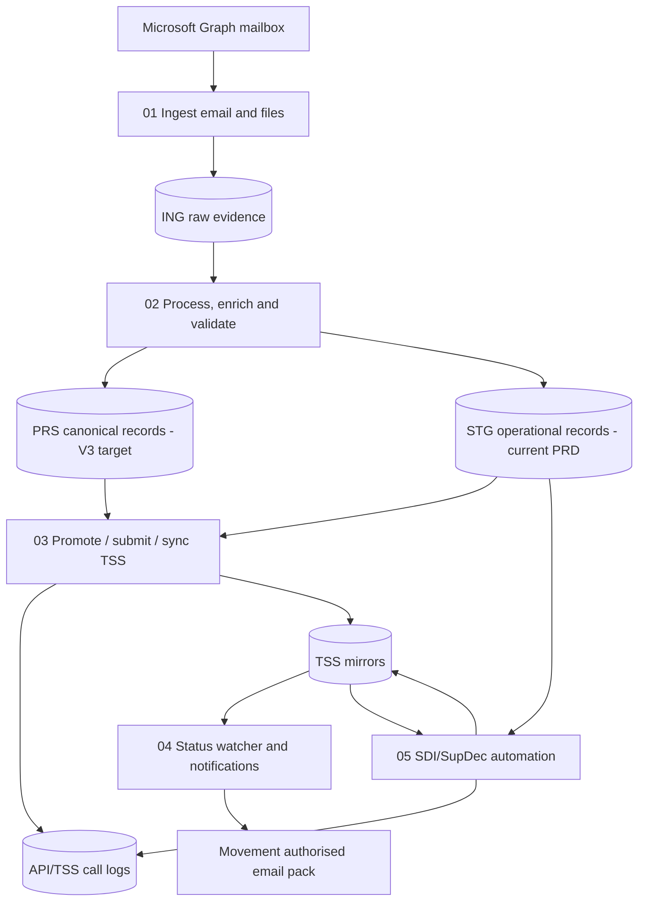

# Fusion Flow V3 Automation

This folder is the clean V3 automation overlay for the BKD production flow now
running in `Fusion_TSS_Automation_PRD`.

It does not replace `Modules/`. The rule is the opposite: `Automation/` is the
small operator-facing orchestration layer, while `Modules/` owns the actual
business logic.

## Operating Model



## The Five Scripts

| Script | Automation responsibility | Current V3 module target | Current PRD/V2 source of truth |
| --- | --- | --- | --- |
| `01_ingest_graph_email_to_ing.py` | Graph mailbox acquisition, email classification, attachment capture, raw evidence landing. | `Modules/Ingestion/ING_00_run_cycle.py` -> `ING_01`, `ING_02`, `ING_03`. | `scripts/pull_inbound_email.py`, `app/ingestion/graph_mail.py`, `app/blueprints/ingest/routes.py`. |
| `02_process_validate_prs.py` | Raw source -> canonical records, masterdata enrichment, local validation. | `Modules/Processing/PRS_01_engine.py`; dev also has preview enrichment/validation helpers. | `app/ingestion/sales_orders_stage.py`, `app/pipeline_validation.py`, `BKD.DocProductCatalog`, `BKD.Partners`. |
| `03_promote_submit_sync_tss.py` | Promote validated records, submit to TSS, mirror responses and fetch JSON. | `Modules/Submission/SUB_01_promote.py`, `SUB_02_submit.py`, `SUB_03_mirror.py`, `SUB_06_fetch_json.py`. | `app/tss_api.py`, `scripts/submit_pipeline.py`, `scripts/sync_prd_ens_statuses.py`, `TSS.BKD_API_Exchanges`. |
| `04_status_notifications.py` | Event-driven status watcher, failure emails, Authorised for Movement, ENS Movement Pack. | To be ported as a V3 notification module; this script documents the required gate. | `app/ingestion/ens_status_watcher.py`, `app/ingestion/automation_notify.py`, `app/templates/declarations/_email_pack_body.html`. |
| `05_sdi_autosubmit.py` | SUP discovery, SDI goods/header enrichment, validation, guarded live submit. | To be ported as a V3 Submission/Processing module pair. | `app/ingestion/sdi_autosubmit.py`, `app/sdi_payloads.py`, `scripts/sdi_autosubmit.py`. |

## End-To-End Flow

### 01. Ingest email and files

Detailed actions:

1. Read the configured BKD mailbox through Microsoft Graph.
2. Classify each message:
   - `DETAILS FOR ...` / `Tss Details` body -> ENS header source.
   - Sales Orders Excel attachment -> consignments and goods source.
   - Product card / partner file -> masterdata evidence.
   - Unknown / incomplete message -> failure event, not a TSS call.
3. Save the original file exactly as received.
4. Register the email, attachment, file path, hashes and source rows in `ING`.
5. Only mark/move the email after the source evidence has been registered.

Current PRD evidence tables:

- `ING.BKD_EmailMessage`
- `ING.BKD_EmailAttachment`
- `ING.BKD_SourceFileLog`
- `ING.BKD_ProcessLog`
- `ING.BKD_SalesOrderLine`

Important rule: the file is evidence. Do not rewrite the customer workbook to
make it easier for Fusion. Derived metadata belongs in DB rows, logs and
processed records.

### 02. Process, enrich and validate

Detailed actions:

1. Read raw evidence from `ING`.
2. Build the business object:
   - ENS header.
   - DEC/consignment.
   - goods items.
   - product/partner masterdata updates, when the source file is masterdata.
3. Enrich from approved masterdata:
   - partner/EORI/address/contact data.
   - product SKU, commodity, country of origin, package type, unit value,
     gross/net unit weights and SDI defaults.
   - document codes from `BKD.DocProductCatalogDocuments`.
   - trader/header defaults from `BKD.SupDecTraderDefaults`.
4. Run validation before TSS:
   - required fields.
   - TSS choice fields.
   - EORI/address format.
   - item value > 0.
   - gross/net/package presence.
   - invalid characters/descriptions.
   - duplicate SUP/SDI detection by transport document plus goods identity.
   - SDI goods identity mapping by stable source item/SKU, not by description alone.
5. Keep blocked rows local and notify operations. Do not spend TSS API calls on
   known-bad records.

Current PRD writes directly to `STG`. V3 target is `ING -> PRS -> STG`.

### 03. Promote, submit and sync TSS

Detailed actions:

1. Promote validated records to the submission layer.
2. Build TSS payloads from validated records only.
3. Enforce submit gates:
   - dry-run/live setting.
   - per-client enabled flag.
   - no validation blockers.
   - no known duplicate risk.
4. Call TSS.
5. Record every request/response.
6. Mirror official TSS state back into local TSS tables.
7. Reconcile local `sub_status` with official remote status without treating
   local status as authoritative.

Current PRD call log:

- `TSS.BKD_API_Exchanges`

V3 target call log:

- `API.Call`

### 04. Status watcher and notifications

Detailed actions:

1. After ENS/DEC submit, watch only the affected ENS chain.
2. Sync official TSS statuses.
3. Trigger failure notifications when staging or TSS rejects data.
4. Trigger movement notification only when:
   - ENS is Authorised for Movement or equivalent final state.
   - all active DEC consignments are authorised.
   - no goods blockers remain.
   - `movement_notified_at` is null.
5. Send customer-facing ENS Movement Pack separately from the internal operational
   Authorised for Movement note.
6. Stamp `movement_notified_at` after a successful final notification.

Recent production rule carried forward: gross weights in ENS Movement Pack must
display with two decimal places to avoid operator confusion.

### 05. SDI / SupDec automation

Detailed actions:

1. Use TSS/SFD evidence to discover the SUP/SDI reference. Fusion must not invent
   `SUP000...`.
2. Load SDI header and SDI goods IDs from TSS.
3. Link SDI goods back to source DEC goods:
   - prefer explicit source item id / item number / SKU.
   - do not use description-only matching as the primary identity.
   - do not fall back to `source_goods[0]` for all remote goods.
4. Enrich SDI goods from:
   - source `STG.BKD_GoodsItems`.
   - approved product masterdata.
   - product document mappings.
   - trader defaults.
5. Validate:
   - missing N935 document identifier.
   - missing item value.
   - missing supplementary unit.
   - missing document code.
   - invalid description/format.
   - duplicate SUP/SDI only when transport document and goods are identical.
6. Submit only when gates are enabled and validation is clean.
7. Store local STG and TSS mirrors plus full API evidence.

Hard stop: do not send any further SDI if the SDI automation kill switch is off.

## Current PRD Database Contract

Live database reviewed: `Fusion_TSS_Automation_PRD`.

Current schema counts:

| Schema | Tables | Notes |
| --- | ---: | --- |
| `BKD` | 6 | Runtime config and current approved masterdata. |
| `ING` | 6 | Raw email/file/source evidence. |
| `STG` | 8 | Current operational submission layer. |
| `TSS` | 68 | API mirrors plus TSS choice/reference tables. |
| `CHG` | 2 | Change/deployment audit. |
| `EXC` | 2 | Manual/action execution spine. |

Important nuance: current PRD does not yet expose the full V3 `CFG`, `PRS`,
`API`, or `LOG` model. The V3 product target uses those layers; the live BKD
runtime still uses `BKD.AppConfiguration`, `STG.BKD_*`, and `TSS.BKD_*`.

### BKD config and masterdata

- `BKD.AppConfiguration`: `id`, `category`, `config_key`, `config_value`,
  `description`, `is_secret`, `updated_at`.
- `BKD.CompanyMaster`: company identity, EORI, address, UKIMS, payment,
  guarantee and status fields.
- `BKD.Partners`: partner type/name, EORI, address, contact email/phone,
  source trace columns and active flag.
- `BKD.DocProductCatalog`: `customer_code`, `sku`, `product_code`,
  `description`, `commodity_code`, `country_of_origin`, `unit_price`,
  `currency`, `gross_weight_kg`, `net_weight_kg`, `package_type`,
  `procedure_code`, `additional_procedure_code`, `preference_code`,
  `ni_additional_information_codes`, `nature_of_transaction`,
  `valuation_method`, `valuation_indicator`, `country_of_preferential_origin`,
  `taric_code`, `cus_code`, `national_additional_code`, `quota_order_number`,
  `controlled_goods_type`, `sdi_notes`.
- `BKD.DocProductCatalogDocuments`: product/document-code mapping, document
  status/reference, evidence count, compliance review flag and auto-apply flag.
- `BKD.SupDecTraderDefaults`: SDI header/goods defaults observed from trader or
  closed history, including procedure, valuation, movement, location,
  importer/exporter and authorisation fields.

### ING evidence

- `ING.BKD_EmailMessage`: email metadata, Graph id, sender, subject,
  received timestamp, attachment count and skip/processed markers.
- `ING.BKD_EmailAttachment`: original/downloaded file name, path, type, size,
  SHA256, source file link and status.
- `ING.BKD_SourceFileLog`: file kind/name/path/date, document number, hash,
  record count and archive path.
- `ING.BKD_ProcessLog`: source row -> target table/ref trace and transform
  status/error.
- `ING.BKD_SalesOrderLine`: source sales order columns such as `DocumentNo`,
  `ItemNo`, `Quantity`, `QuantityBase`, `LineAmountExclVat`,
  `UnitPriceExclVat`, `QtyPerUom`, `UnitOfMeasureCode`.
- `ING.BKD_TSSPayloadFieldLineage`: field-level lineage catalogue for TSS
  payload fields.

### STG operational records

- `STG.BKD_ENS_Headers`: ENS local/TSS state, ICR/conveyance, arrival,
  carrier, ports, validation errors, `movement_notified_at`.
- `STG.BKD_ENS_Consignments`: DEC/consignment fields, parties, transport
  document number, consignee contact email, metadata JSON.
- `STG.BKD_GoodsItems`: source ENS/SFD goods, SKU, description, commodity,
  gross/net mass, packages, invoice values, procedure/document enrichment,
  nested JSON fields.
- `STG.BKD_SFD_Tracking`: SFD polling state, MRN/EIDR/control status and
  TSS error message.
- `STG.BKD_SDI_Headers`: SUP/SDI local state, TSS SUP number, due date,
  status, transport/trader/header data, auto-submit fields and validation JSON.
- `STG.BKD_SDI_GoodsItems`: SUP/SDI goods, `source_stg_item_id`,
  `tss_goods_id`, description, commodity, weights, values, document/reference
  JSON and SDI validation fields.
- `STG.BKD_GMR_Movements`: GMR reference, route, vehicle/trailer and GVMS state.
- `STG.BKD_IMMI_Tracking`: IMMI/GLR tracking state.

### TSS mirrors and calls

- `TSS.BKD_API_Exchanges`: every relevant API/email call with request payload,
  response JSON/status, duration, errors and timestamp.
- `TSS.BKD_ENS_Headers`: TSS ENS reference, status, movement/arrival/carrier
  fields and raw JSON.
- `TSS.BKD_ENS_Consignments`: TSS DEC/ENS/consignment references, status,
  goods description, importer and raw JSON.
- `TSS.BKD_GoodsItems`: ENS/source goods mirror with goods id, parent reference,
  item number, status and raw JSON.
- `TSS.BKD_SFD`: SFD reference, declaration number, ENS reference, MRN/status
  and raw JSON.
- `TSS.BKD_SDI_Headers`: SUP number, SFD reference, MRN, status, due date and
  raw JSON.
- `TSS.BKD_SDI_GoodsItems`: SUP goods id, SUP/SFD reference, item number,
  status and raw JSON.
- `TSS.BKD_GMR_Movements`: GMR/GVMS mirror.
- `TSS.BKD_JobRuns`: operational job run log.
- `TSS.CV_*`: TSS choice/reference data such as `CV_type_of_package`,
  `CV_document_code`, `CV_preference`, `CV_procedure_code`, countries, ports,
  valuation and additional information choices.

### EXC / CHG audit

- `EXC.Execution`: manual or automated action execution record, route/user,
  entity, status, request/response JSON.
- `EXC.Transaction`: per-entity transaction under an execution.
- `CHG.Deployment`: repo/branch/commit/deploy record.
- `CHG.Change_Log`: before/after change log for manual portal edits and
  important operational actions.

## Validation Gates

Validation is intentionally split by layer:

| Layer | Gate | Examples |
| --- | --- | --- |
| Ingestion | Evidence gate | Message allowed sender, attachment present, file saved, hash/path stored, DETAILS body recognised. |
| Processing | Structural gate | Required fields, parseable dates, one ENS anchor, no orphan consignments, no Amazon voucher goods. |
| Processing | Masterdata gate | Partner by EORI/name, product by SKU, package type, commodity, country, values, weights. |
| Processing | TSS format gate | max length, invalid characters, choice value membership, valid package/document/status codes. |
| Submission | Risk gate | no duplicate SUP unless goods also identical, no known SDI mapping risk, no submit when kill switch off. |
| Notification | Official status gate | use TSS status, not local status, before sending Authorised for Movement or ENS Movement Pack. |

Specific recent rules to preserve:

- Product lookup is SKU-first. Goods description can change and must not be the
  primary identity.
- Gross/net weights must be `unit_weight * Quantity`; do not multiply by
  `QtyPerUom` or text like `BOX 100`.
- `transport_document_number` for ENS/consignment should be the ICR/conveyance
  from the DETAILS email, not the `S-ORD` sales order reference.
- SDI goods matching must keep `source_stg_item_id <-> tss_goods_id` stable.
- Pending Payment is not an error state by itself; show it as a payment/review
  state, with TSS response details available separately.
- Manual portal edits and manual submits/cancels must write `EXC`/`CHG` audit.

## How To Run

From the repo root:

```powershell
python Automation\01_ingest_graph_email_to_ing.py
python Automation\02_process_validate_prs.py
python Automation\03_promote_submit_sync_tss.py --steps promote submit mirror fetch-json
python Automation\04_status_notifications.py --explain
python Automation\05_sdi_autosubmit.py --explain
```

Safety is data/config-driven. Before live submit, verify the DB gates:

- current environment / credentials.
- submit dry-run setting.
- notification recipients.
- SDI autosubmit kill switch.
- no validation blockers.

## Source Review

This folder was prepared from:

- V3 `Master` Modules:
  - `Modules/Ingestion/ING_00_run_cycle.py`
  - `Modules/Processing/PRS_01_engine.py`
  - `Modules/Submission/SUB_01_promote.py`
  - `Modules/Submission/SUB_02_submit.py`
  - `Modules/Submission/SUB_03_mirror.py`
  - `Modules/Submission/SUB_06_fetch_json.py`
- V3 `dev` context:
  - updated ingestion parsing, processing mapping, submission updates,
    preview enrichment/validation helpers.
- Current BKD production implementation:
  - `scripts/pull_inbound_email.py`
  - `app/ingestion/graph_mail.py`
  - `app/ingestion/sales_orders_stage.py`
  - `app/ingestion/ens_status_watcher.py`
  - `app/ingestion/automation_notify.py`
  - `app/ingestion/sdi_autosubmit.py`
  - `app/sdi_payloads.py`
  - `app/tss_api.py`
  - `Fusion_TSS_Automation_PRD` schema snapshot.
