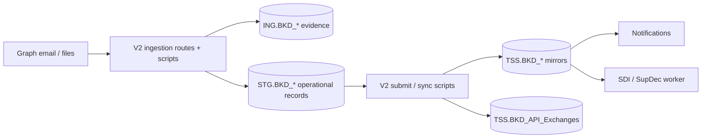
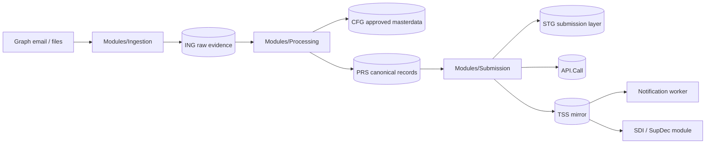

# Fusion Flow V3 Automation

This folder is the clean version of the automation flow we are aiming for.

The production logic still lives mainly in the BKD V2 repo, but this folder
shows how it should be split in V3: small scripts, clear ownership, and no
business logic hidden inside the portal.

## Operating Model

### Current

This works and has real production behaviour, but the ownership is still mixed:
portal routes, scripts and ingestion helpers all do part of the job.

### Expected

This is the target: `Modules/` own the work, the portal controls/reviews it, and
the database keeps the trace.

The important rule is simple:

**ING keeps what arrived. CFG keeps what we trust. PRS keeps what we intend to
send. STG/API/TSS keep what we submitted and what TSS returned.**

## Scripts

| Script | What it owns | Current production reference |
| --- | --- | --- |
| `01_ingest_graph_email_to_ing.py` | Get emails/files, classify them, save the original evidence. | `scripts/pull_inbound_email.py`, Graph ingestion, `/ingest` routes. |
| `02_process_validate_prs.py` | Turn raw source into clean ENS/DEC/goods records, enrich from masterdata, block bad rows early. | `sales_orders_stage.py`, validation helpers, BKD product/partner masterdata. |
| `03_promote_submit_sync_tss.py` | Promote clean records, call TSS, store request/response, mirror status. | `submit_pipeline.py`, `tss_api.py`, sync scripts. |
| `04_status_notifications.py` | Watch official TSS status and send internal/customer emails at the right time. | ENS watcher, automation notifications, ENS Movement Pack templates. |
| `05_sdi_autosubmit.py` | Discover SUP/SDI, enrich goods/header, validate, submit only when safe. | `sdi_autosubmit.py`, `sdi_payloads.py`, SDI views. |

## What must stay true

- Original files are evidence. Do not rewrite the customer workbook.
- Product lookup is SKU-first. Description can change and is not a stable key.
- Weights are `unit weight * quantity`. Do not multiply by `QtyPerUom`.
- ENS transport document number should come from the ICR/conveyance, not the
  `S-ORD`.
- SDI goods must keep a stable link between source goods and TSS goods id.
- Duplicate SUP/SDI means same transport reference and same goods, not just the
  same `S-ORD`.
- Pending Payment is not automatically an error.
- Manual edits, manual submits and manual cancels must be auditable.

## Current database reality

Current BKD production is still not pure V3. It mainly uses:

- `ING.BKD_*` for email/file/source evidence.
- `STG.BKD_*` for operational ENS, consignments, goods, SFD, SDI and GMR.
- `TSS.BKD_*` for TSS mirrors and API evidence.
- `BKD.*` for current approved config/masterdata.
- `EXC` / `CHG` for execution and change audit.

The V3 target is cleaner:

- `ING` for source evidence.
- `CFG` for approved config, masterdata and choice values.
- `PRS` for canonical records before submit.
- `STG` / `API` / `TSS` for submit, response and mirror.
- `EXC` / `LOG` / `CHG` for operations and audit.

## How to read this folder

This is not another parallel system. It is the shape we should move towards.

Use it to keep the automation readable:

1. ingest only source evidence,
2. process and validate before TSS,
3. submit only clean records,
4. mirror official TSS state,
5. notify from official status,
6. keep SDI gated until mapping is proven.

No commit has to include runtime changes just because this documentation exists.
