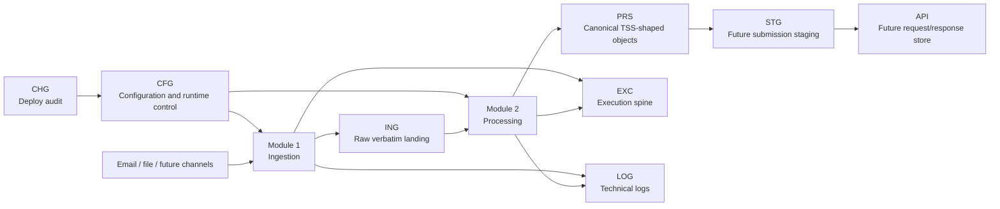
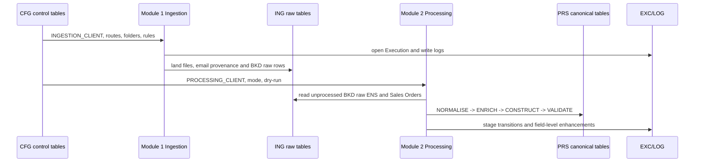
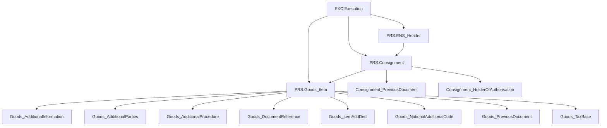

<p align="center">
  
</p>

# Fusion Flow V3 QAS

Fusion Flow V3 QAS is the Release 1 pipeline for controlled inbound-data capture,
canonical processing and future TSS API submission. The current source of truth is:

- `Configuration/SQL/` for schemas, tables, constraints and seed data.
- `Modules/Ingestion/` for Module 1 raw ingestion.
- `Modules/Processing/` for Module 2 PRS construction and validation.
- `Development/Deploy/` and `Development/Review/` for database deployment and review tooling.

`Deprecated/` is legacy reference only. Do not treat `Deprecated/Integration_Layer/FLOW_V3`
or the old `ING.Graph` / `EXC.Graph` model as the current architecture.

## Live DB Snapshot

Metadata below was read from the live `Fusion_Flow_V3_QAS` database on
`2026-06-30 16:09 UTC`. Row counts are operational counts at that moment and will
change as ingestion/processing runs.

| Schema | Tables | State |
| --- | ---: | --- |
| `CFG` | 13 | Deployed configuration/control layer. |
| `CHG` | 2 | Deployed change/deployment audit layer. |
| `EXC` | 4 | Deployed execution spine and transaction state. |
| `ING` | 5 | Deployed raw ingestion layer with BKD source rows loaded. |
| `LOG` | 3 | Deployed technical/process/API logging layer. |
| `PRS` | 13 | Deployed canonical processing layer; top-level PRS tables are currently empty. |
| `API` | 0 | Reserved for future request/response persistence. |
| `STG` | 0 | Reserved for future submission-ready staging mirrors. |
| `BKD` | 0 | Reserved client schema; live BKD operational tables currently live in `ING`/`PRS`. |
| `CTL` | 0 | Reserved control/orchestration schema. |
| `ARC` | 0 | Reserved archive/history schema. |
| `SRV` | 0 | Reserved service/presentation schema. |

Known drift: `Configuration/SQL/012_cfg_jobs.sql` defines `CFG.Job`, and
`Modules/Ingestion/run_ingestion.py` expects it. The live DB snapshot did not
contain `CFG.Job`, so the runner falls back to its built-in BKD step list until
that script is deployed.

## Architecture



## Layer Model

| Code | Layer | Purpose | Key live tables |
| --- | --- | --- | --- |
| `CFG` | Configuration | Runtime settings, clients, credentials, folder paths, email/source routing, API rules, choice caches and status vocabulary. | `Application_Parameters`, `Clients`, `Credentials`, `Folder_Paths`, `Email_Rules`, `API_Version`, `API_Process_Map`, `Choice_Field_Registry`, `Choice_Value_Cache`, `Status_Vocabulary`, `Ingestion_Source`, `TSS_Environment`, `TSS_Credential`. |
| `ING` | Ingestion raw | Inbound artefacts landed verbatim from every source channel; no business transformation. | `Inbound_File`, `Raw_Record`, `Source_Email`, `BKD_Raw_ENS`, `BKD_Raw_Sales_Orders`. |
| `EXC` | Execution | Master execution spine, per-entity transaction transitions, errors and field-level processing enhancements. | `Execution`, `[Transaction]`, `Error`, `Data_Processing_Enhancement`. |
| `LOG` | Log | Detailed process, error and API traces. More technical/deep than `EXC`. | `Process_Log`, `Error_Log`, `API_Trace`. |
| `PRS` | Processing | Enhanced, enriched and constructed canonical objects shaped for TSS before submission. | `ENS_Header`, `Consignment`, `Goods_Item` and 10 nested child tables. |
| `STG` | Staging | Future submission-ready mirrors/client-prefixed tables. | Empty in live DB. |
| `API` | API | Future full request/response JSON plus deserialised columns. | Empty in live DB. |
| `CHG` | Change audit | SQL deployment run and script-level audit trail. | `Deployment`, `Change_Log`. |

## Runtime Flow



## Table Catalog

### `CFG` - Configuration And Runtime Control

| Table | Rows | Purpose | Key / refs |
| --- | ---: | --- | --- |
| `CFG.Application_Parameters` | 28 | Global runtime settings such as environment, module controls and roots. The DB connection stays outside this table. | PK `ParameterID`; unique `ParameterKey`. |
| `CFG.Clients` | 3 | Principal registry for 3-letter clients, schema/prefix, default route and agent flag. Live rows include `BKD` active, `CWD` inactive and `PLE` inactive. | PK `ClientID`; unique `ClientCode`. |
| `CFG.Credentials` | 4 | TSS credential metadata: username plus secret reference, not plaintext secrets. | PK `CredentialID`; FK to `CFG.Clients`. |
| `CFG.Folder_Paths` | 13 | Per-client operational folder registry for `INBOUND`, `ENS_SOURCE`, `PROCESS`, `FAIL` and `ARCHIVE`. | PK `PathID`; FK to `CFG.Clients`; unique client/path type. |
| `CFG.Email_Rules` | 3 | Mailbox, sender-domain/address and allowed-file routing per client. | PK `RuleID`; FK to `CFG.Clients`. |
| `CFG.API_Version` | 3 | Per-client TSS resource version switch and TEST/PROD base URLs. | PK `VersionID`; FK to `CFG.Clients`. |
| `CFG.API_Process_Map` | 13 | Ordered API route plan per client and route: endpoint, HTTP method, operation type and waits. | PK `MapID`; FK to `CFG.Clients`; unique client/route/step. |
| `CFG.Choice_Field_Registry` | 35 | List of TSS choice fields to bootstrap from `GET /choice_values/<field>`. | PK `FieldID`; unique `ChoiceField`. |
| `CFG.Choice_Value_Cache` | 0 | Cached TSS choice values and metadata once bootstrapped. | PK `ChoiceID`; unique `ChoiceField`, `ChoiceValue`. |
| `CFG.Status_Vocabulary` | 19 | Shared process/status vocabulary for ingestion, processing, submission and monitoring. | PK `VocabID`; unique `ResultStatus`. |
| `CFG.Ingestion_Source` | 4 | DB-driven acquisition-channel registry per client: `EMAIL`, `SFTP`, `AS2`, `API`, `FILE_DROP`. | PK `SourceID`; FK to `CFG.Clients`; unique client/channel. |
| `CFG.TSS_Environment` | 2 | TSS environment endpoints and active flags, normally `TEST` and `PROD`. | PK `EnvCode`. |
| `CFG.TSS_Credential` | 6 | Per-client/per-environment TSS username and verification status. | PK `ClientCode`, `EnvCode`; FK to `CFG.TSS_Environment`. |

Expected but not live: `CFG.Job` is the canonical job registry for scheduler
orchestration and is seeded by `012_cfg_jobs.sql`.

### `CHG` - Change Management

| Table | Rows | Purpose | Key / refs |
| --- | ---: | --- | --- |
| `CHG.Deployment` | 6 | One row per deployment run: run stamp, description, server/database, counts and status. | PK `DeploymentID`. |
| `CHG.Change_Log` | 20 | One row per SQL script applied, including script hash, batch count, status and archive path. | PK `ChangeID`; FK to `CHG.Deployment`. |

### `EXC` - Execution Spine

| Table | Rows | Purpose | Key / refs |
| --- | ---: | --- | --- |
| `EXC.Execution` | 16 | Master run record. Every module opens an execution with a `TransactionID` that threads through `ING`, `PRS`, future `STG/API` and logs. | PK `ExecutionID`; indexed by `TransactionID`, client and status. |
| `EXC.[Transaction]` | 0 | Per-entity stage transitions inside an execution, for example `NORMALISING -> NORMALISED`. | PK `TransactionRowID`; FK to `EXC.Execution`. |
| `EXC.Error` | 0 | Execution-level business/process errors. | PK `ErrorID`. |
| `EXC.Data_Processing_Enhancement` | 0 | Field-level audit for Module 2 changes: old value, new value and rule applied. | PK `EnhancementID`. |

### `ING` - Raw Ingestion

| Table | Rows | Purpose | Key / refs |
| --- | ---: | --- | --- |
| `ING.Inbound_File` | 6 | One row per landed file from any channel with source provenance, hash, size and status. | PK `FileID`; FK to `CFG.Clients` and `EXC.Execution`; unique client/file hash. |
| `ING.Raw_Record` | 0 | Verbatim parsed source rows as JSON, one row per source row. | PK `RawID`; FK to `ING.Inbound_File`. |
| `ING.Source_Email` | 0 | Email-channel provenance: mailbox, sender, subject, body preview and Graph identifiers. | PK `EmailID`. |
| `ING.BKD_Raw_ENS` | 8 | Typed rows from generated `ENS_Headers_*.csv`; dedup key is `DetailsDate|ICR`. | PK `LoadID`; FK to `EXC.Execution`; unique `DedupKey`. |
| `ING.BKD_Raw_Sales_Orders` | 293 | Verbatim Sales Order workbook lines as JSON with file/date/row provenance. | PK `LoadID`; FK to `EXC.Execution`; unique source file/row number. |

Rule: `ING` preserves what arrived. Normalisation and enrichment belong in `PRS`,
not in raw tables.

### `LOG` - Technical Logging

| Table | Rows | Purpose | Key / refs |
| --- | ---: | --- | --- |
| `LOG.Process_Log` | 84 | Step-level process logs with module, client, level, message and optional JSON detail. | PK `LogID`. |
| `LOG.Error_Log` | 9 | Dedicated technical error log with error type and stack trace. | PK `ErrorLogID`. |
| `LOG.API_Trace` | 0 | Future full API request/response trace for Module 3 submission/monitoring. | PK `TraceID`. |

### `PRS` - Canonical Processing

`PRS` holds the canonical object model after Module 2 processing. It is shaped as
one ENS header, many consignments, many goods items and nested arrays. It is not
the final API submission store; future `STG` materialises validated PRS movements
into submission-ready structures.



| Table | Rows | Purpose | Key / refs |
| --- | ---: | --- | --- |
| `PRS.ENS_Header` | 0 | One row per logical movement; carries movement key, source ENS load, lifecycle status and header-level TSS fields. | PK `EnsHeaderRowID`; FK to `EXC.Execution`; unique client/movement key. |
| `PRS.Consignment` | 0 | Child consignments for an ENS header, including party blocks and consignment-level TSS fields. | PK `ConsignmentRowID`; FK to `PRS.ENS_Header` and `EXC.Execution`. |
| `PRS.Goods_Item` | 0 | Goods items under a consignment; runner validates the 1..99 goods cardinality rule. | PK `GoodsItemRowID`; FK to `PRS.Consignment` and `EXC.Execution`. |
| `PRS.Consignment_PreviousDocument` | 0 | Consignment-level previous-document array. | PK `ConsignmentPreviousDocumentRowID`; FK to `PRS.Consignment`. |
| `PRS.Consignment_HolderOfAuthorisation` | 0 | Consignment-level holder-of-authorisation array. | PK `ConsignmentHolderOfAuthorisationRowID`; FK to `PRS.Consignment`. |
| `PRS.Goods_AdditionalProcedure` | 0 | Goods-level additional-procedure array. | PK `GoodsAdditionalProcedureRowID`; FK to `PRS.Goods_Item`. |
| `PRS.Goods_DocumentReference` | 0 | Goods-level document-reference array. | PK `GoodsDocumentReferenceRowID`; FK to `PRS.Goods_Item`. |
| `PRS.Goods_AdditionalInformation` | 0 | Goods-level additional-information array. | PK `GoodsAdditionalInformationRowID`; FK to `PRS.Goods_Item`. |
| `PRS.Goods_PreviousDocument` | 0 | Goods-level previous-document array. | PK `GoodsPreviousDocumentRowID`; FK to `PRS.Goods_Item`. |
| `PRS.Goods_ItemAddDed` | 0 | Goods-level additions/deductions array. | PK `GoodsItemAddDedRowID`; FK to `PRS.Goods_Item`. |
| `PRS.Goods_NationalAdditionalCode` | 0 | Goods-level national-additional-code array. | PK `GoodsNationalAdditionalCodeRowID`; FK to `PRS.Goods_Item`. |
| `PRS.Goods_TaxBase` | 0 | Goods-level tax-base array. | PK `GoodsTaxBaseRowID`; FK to `PRS.Goods_Item`. |
| `PRS.Goods_AdditionalParties` | 0 | Goods-level additional-parties array, provisioned for supplementary declaration coverage. | PK `GoodsAdditionalPartiesRowID`; FK to `PRS.Goods_Item`. |

## Modules

| Module | Entry point | Reads | Writes | Notes |
| --- | --- | --- | --- | --- |
| Deploy | `python Development/Deploy/deploy.py --source Configuration/SQL` | `Configuration/SQL/` | DB + `CHG` audit | SQL scripts are idempotent and deployment-audited. |
| Review | `python Development/Review/export_datamodel.py --all` | Live DB metadata/data | Excel workbook | Use for full DB review exports. |
| Ingestion | `python Modules/Ingestion/run_ingestion.py` | `CFG`, Graph/email/files | `ING`, `EXC`, `LOG` | Reads `CFG.Job` when present; otherwise BKD fallback steps. |
| Processing | `python Modules/Processing/process_data.py` | `CFG`, `ING.BKD_Raw_*` | `PRS`, `EXC`, `LOG` | Runs `NORMALISE -> ENRICH -> CONSTRUCT -> VALIDATE`. |
| Credentials | `python Modules/Global/seed_credentials.py` | gitignored JSON | `CFG.TSS_Environment`, `CFG.TSS_Credential` | Never commit real credentials. |

## Operating Rules

- Keep DB connection details in `Configuration/Fusion_Flow_QAS.ini` or local
  environment settings only. Do not commit secrets.
- Add or change tables in `Configuration/SQL/` first, then deploy with the
  deployment runner so `CHG` stays authoritative.
- Keep raw source data verbatim in `ING`; transformations belong in `PRS`.
- Thread `EXC.Execution.TransactionID` through every module run and table family.
- Use `CFG` rows for clients, folder paths, source routing and runtime controls
  before hard-coding behavior.
- Treat `API` and `STG` as planned future layers until their SQL scripts are
  deployed.

## Quick Commands

```powershell
cd "\\pl-az-sdf-plint\Fusion_Production\Scratch\Fusion_Flow_V3_QAS"

# Dry-run SQL deployment review
python Development\Deploy\deploy.py --source Configuration\SQL --dry-run

# Run Module 1 ingestion
python Modules\Ingestion\run_ingestion.py

# Run Module 2 processing
python Modules\Processing\process_data.py

# Export a database model workbook
python Development\Review\export_datamodel.py --all
```

Before running the modules on a new machine, copy
`Configuration/Fusion_Flow_QAS.example.ini` to the gitignored
`Configuration/Fusion_Flow_QAS.ini` and fill the local database connection
settings.