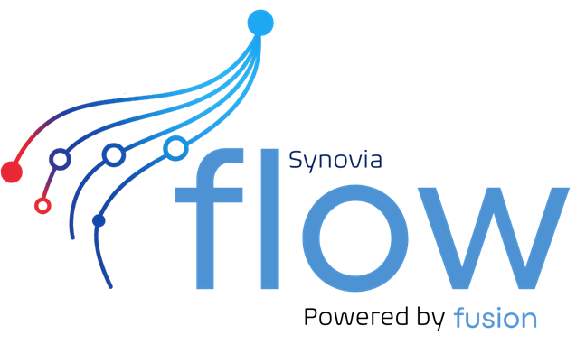
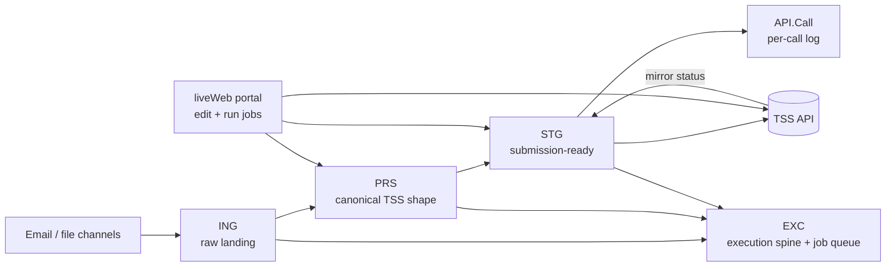

<p align="center">
  
</p>

# Fusion Flow V3 QAS

Fusion Flow V3 QAS is the end-to-end pipeline that ingests controlled inbound data,
processes it into the canonical TSS shape, submits declarations to the Trader Support
Service (TSS), and mirrors their live status back — all driven and monitored from a
single operations portal.

The flow is: **acquire → load raw → transform + validate → promote → submit → mirror**,
with every step tracked in the `EXC` execution spine and every TSS call logged to
`API.Call`.

> **Deployment is hybrid** — one core database (Azure SQL), jobs run **locally**
> (on-prem, near the mailbox/files/TSS), and the **hosted portal** connects to the same
> database and enqueues work for a local worker. See **[ARCHITECTURE.md](ARCHITECTURE.md)**.

---

## The portal — `liveWeb/`

**`liveWeb/` is the Synovia Flow 3 portal — the operator UI for the whole platform.**
It serves the single-page portal plus a small API (`liveWeb/app.py`) that reads a live
"blueprint" straight from the database and runs jobs per movement.

From a movement's pipeline drill-down you can, for one movement:

- **Edit fields** (`arrival_date_time`, `movement_type`, carrier, seal, …) → `POST /api/edit`
- **Promote / Submit / Mirror / Update / Cancel / Reprocess** → `POST /api/action/<verb>`
- **Fix arrival & resubmit** — one click chains reprocess → promote → submit
- Queue any of the above for the background worker → `POST /api/enqueue/<verb>`

The buttons run the **real** jobs (no demo mode). Safety is controlled by
`SUBMISSION_ENV` (e.g. `TST`) and `SUBMISSION_DRY_RUN` in `CFG.Application_Parameters`,
not by a UI toggle. See [`liveWeb/README.md`](liveWeb/README.md) for the portal detail.

| Endpoint | Purpose |
| --- | --- |
| `GET /` + `/<file>` | the portal + assets |
| `GET /api/blueprint` | live blueprint from the DB (30s cache; falls back to committed `blueprint.json`) |
| `GET /api/health` | liveness probe |
| `POST /api/action/<verb>` | run a job for one movement (in-process) |
| `POST /api/enqueue/<verb>` | queue a job for the worker (returns 202) |
| `POST /api/edit` | patch whitelisted STG payload fields |
| `GET /api/executions` | recent `EXC.Execution` + `EXC.Job_Queue` rows (the **Log** page) |

The portal's **Log** view shows recent job executions and the portal queue, so you can
watch what the scheduled crons and the on-prem worker are doing.

---

## Jobs — `Modules/`

Runnable jobs are named in pipeline order (`ING_ → PRS_ → SUB_`, plus `REF_`/`REP_`);
shared libraries keep descriptive names. Every job reads scope from
`CFG.Application_Parameters` (or a per-run override the portal passes) and connects via
`DB_*` env vars, falling back to `Configuration/Fusion_Flow_QAS.ini` locally.

| Job | Script | Does |
| --- | --- | --- |
| Ingestion cycle | `Modules/Ingestion/ING_00_run_cycle.py` | orchestrates the steps below from `CFG.Job` |
| — acquire | `ING_01_acquire_email.py` | pull email attachments (Microsoft Graph) |
| — parse | `ING_02_parse_ens.py` | parse ENS headers to CSV |
| — load | `ING_03_load_raw.py` | load raw ENS + sales orders into `ING.*` |
| Process | `Modules/Processing/PRS_01_engine.py` | config-driven transform + validate → `PRS.*` |
| Reprocess | `PRS_02_reprocess.py` | re-run rejected rows through the engine |
| Promote | `Modules/Submission/SUB_01_promote.py` | promote validated rows → `STG` |
| Submit | `SUB_02_submit.py` | POST create to TSS `/headers` |
| Mirror (status check) | `SUB_03_mirror.py` | GET live declarations → refresh `Tss_Status` |
| Update | `SUB_04_update.py` | full-replacement update (Rule 16) |
| Cancel | `SUB_05_cancel.py` | cancel a live declaration |
| Fetch JSON | `SUB_06_fetch_json.py` | pull TSS response JSON (status evidence) |
| Reference | `Modules/Global/REF_01_choice_values.py`, `REF_02_commodity_codes.py` | refresh TSS reference data |
| Reporting | `Modules/Global/REP_01_db_snapshot.py`, `REP_02_reference_lists.py` | Excel exports |

Run the whole local cycle by hand with **`python Modules/run_all.py`** (ingest →
process → promote → submit → mirror → fetch; `--only` / `--skip` / `--list` / `--stop-on-error`).

**Libraries / infra (imported by name, not run directly):** `ingest`, `graph_email`,
`xlsx_reader`, `submission_db`, `tss_client`, `process_data`, `mapping`,
`check_choice`, `seed_credentials`, `job_worker`. Retired scripts live in
`Modules/_retired/`.

### Working note - BKD Sheet 3 ING to PRS inspection

On 2026-07-07 we inspected a pasted `ING` extract from a BKD Sales Orders Graph
attachment, scoped by the operator as Sheet 3. The extract is used only to
understand how raw attachment rows should become PRS consignments and goods.

No database table was created for this inspection. Proposed names such as
`PRS.BKD_ENS_Consignments_IN`, `PRS.BKD_ENS_Consignments_OUT`,
`PRS.BKD_ENS_Consignments_GoodsItems_IN`, and
`PRS.BKD_ENS_Consignments_GoodsItems_OUT` are logical review shapes only. The
current rule is to reuse the existing V3 model unless a real schema gap is proven
and explicitly approved.

The current simplified workbook is:

`Documentation_Layer/BKD_Sheet3_API_Needs_Only_With_ING_Execution_78_20260707_110018.xlsx`

It contains one purpose sheet and four simple IN/OUT sheets. The simplified workbook includes `ING_ExecutionID` and `ING_LoadID` traceability from the pasted `ING` rows. OUT sheets are intentionally API-needs-only, not full PRS/STG internal records:

- `PURPOSE`: arrows and intent for the logical shapes.
- `Consigments_IN`: what the client supplied for candidate consignments.
- `Consigments_OUT`: the CFG-enriched consignment shape expected by the TSS API.
- `GoodsItems_IN`: what the client supplied for goods lines.
- `GoodsItems_OUT`: the CFG-enriched goods payload shape expected under each consignment.

The logical names are:

- `PRS.BKD_ENS_Consigments_IN`
- `PRS.BKD_ENS_Consigments_OUT`
- `PRS.BKD_ENS_Consigments_GoodsItems_IN`
- `PRS.BKD_ENS_Consigments_GoodsItems_OUT`

The intended future promotion/rename direction is:

```text
PRS.BKD_ENS_Consigments_OUT
  -> STG.BKD_ENS_Consigments

PRS.BKD_ENS_Consigments_GoodsItems_OUT
  -> STG.BKD_ENS_Consigments_GoodsItems
```

The pasted rows had `SheetName = NULL`, so the workbook labels the scope as
"Sheet 3" only because that was the supplied operator context. No postcode,
country, EORI, weight, commodity code, or package enrichment was invented from the
pasted data. Those remain validation/enrichment gaps for `Modules/Processing`.

### Background worker + queue (Pattern B)

`POST /api/enqueue/<verb>` writes a `PENDING` row to `EXC.Job_Queue`;
`Modules/Global/job_worker.py` claims it atomically and runs the same runner with
per-run scope, recording the outcome. Use it for batches or long runs so the request
returns immediately.

### Rule 4 — arrival is never in the past

TSS rejects a past `arrival_date_time`. The engine auto-corrects: a past arrival is
moved to **tomorrow** (same time of day) instead of being rejected. From the portal,
**Fix arrival & resubmit** applies this and re-sends in one click.

---

## Architecture


```mermaid
flowchart LR
    PORTAL[liveWeb portal<br/>edit + run jobs]
    SRC[Email / file channels]
    ING[ING<br/>raw landing]
    PRS[PRS<br/>canonical TSS shape]
    STG[STG<br/>submission-ready]
    TSS[(TSS API)]
    APILOG[API.Call<br/>per-call log]
    EXC[EXC<br/>execution spine + job queue]

    SRC --> ING --> PRS --> STG --> TSS
    TSS -->|mirror status| STG
    PORTAL --> PRS
    PORTAL --> STG
    PORTAL --> TSS
    STG --> APILOG
    ING --> EXC
    PRS --> EXC
    STG --> EXC
```

---

## Deployment (Render)

The repo-root [`render.yaml`](render.yaml) is the authoritative blueprint; one repo-root
`Dockerfile` builds a single image (portal **+** `Modules/` + the Microsoft ODBC driver)
used by every service. It defines two stacks:

- **Stack A — the portal (deploy this):** `synovia-flow-3-live` (web), `ff-worker`
  (queue drain), and cron jobs `ff-cron-ingestion` / `-processing` / `-mirror` (TSS
  status, every 30 min) / `-fetch-json` / `-ref-choice`.
- **Stack B — optional:** `fusion-flow-api` + `fusion-flow-portal` (a separate Vite/API
  app carried over from `dev`). Not the primary portal; deploy only if you want it.

Deploy: **Render → New → Blueprint → this repo/`Master`**, select the Stack A services,
provide the `DB_*` secrets, and allow the services' outbound IPs through the Azure SQL
firewall. Health check: `/api/health`.

---

## Database & deployment tooling

- Canonical DDL/seed lives in `Configuration/SQL/` (`028 … 034`).
  `033_job_queue.sql` creates `EXC.Job_Queue`; `034_cfg_job_entrypoints.sql` re-points
  `CFG.Job.EntryPoint` to the sequence-named scripts.
- Apply with `Development/Deploy/deploy.py` (stages from `Configuration/SQL`, logs to
  the `CHG` schema, archives on success). It connects via `DB_*` env vars or the
  gitignored `.ini`:

```powershell
# either set DB_* in the environment, or copy the template and set the password:
copy Configuration\Fusion_Flow_QAS.example.ini Configuration\Fusion_Flow_QAS.ini
python Development\Deploy\deploy.py --source Configuration\SQL --dry-run   # preview
python Development\Deploy\deploy.py --source Configuration\SQL             # apply
```

**Schemas:** `CFG` (config/control), `CHG` (deploy audit), `EXC` (execution spine +
job queue), `ING` (raw ingestion), `PRS` (canonical), `STG` (submission-ready),
`API` (per-call log), `LOG` (technical/process logs).

---

## Configuration & safety

All run behaviour is data in `CFG.Application_Parameters` — e.g. `SUBMISSION_ENV`
(`TST`), `SUBMISSION_DRY_RUN`, `SUBMISSION_MAX_ROWS`, `PROCESSING_MODE`. The portal and
the worker scope a single-movement run with in-memory overrides, so concurrent runs
never clobber each other's scope.

---

## Repository layout

| Path | What |
| --- | --- |
| `liveWeb/` | **the portal** (UI + `app.py` API + `tools/`) |
| `Modules/` | ingestion / processing / submission / global jobs + `job_worker` |
| `Configuration/` | connection template + `SQL/` migrations |
| `Development/` | `Deploy/` (deploy.py, stage_queue.py) + `Review/` tooling |
| `render.yaml`, `Dockerfile`, `requirements.txt` | deployment |
| `Integration_Layer/`, `Database_Layer/` | Stack B (fusion_api + Vite portal) from `dev` |
| `Documentation/`, `Inbound/`, `Branding/`, `assets/` | specs, source samples, brand |
| `Deprecated/`, `Modules/_retired/` | legacy reference only — not the current architecture |
